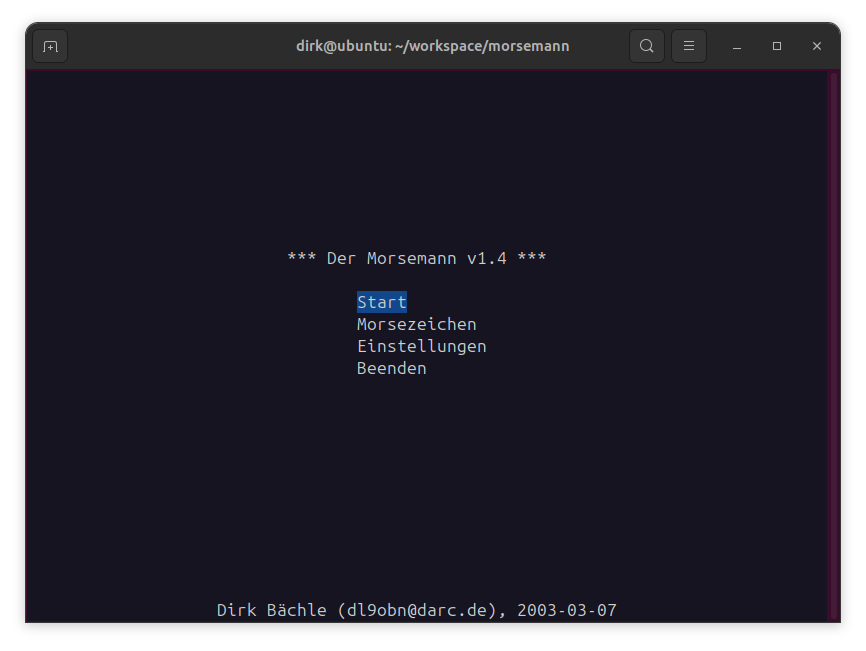
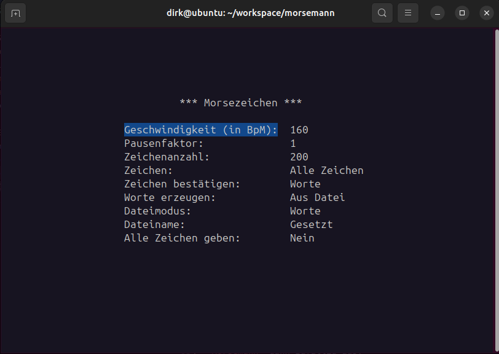
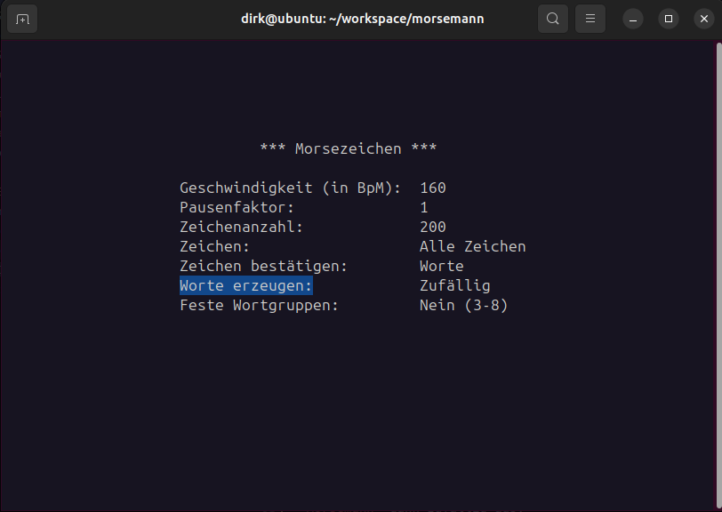
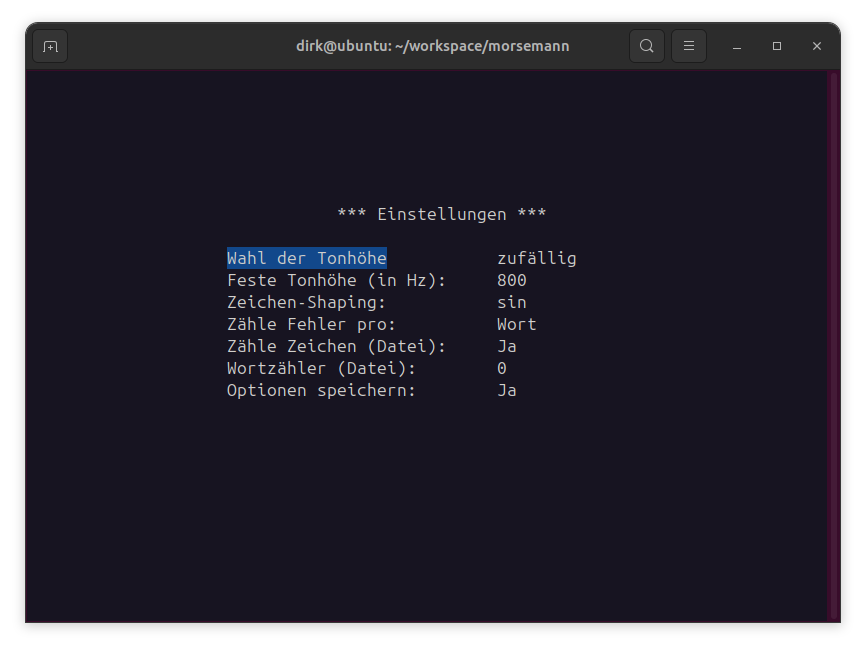

# Morsemann
Ein Programm für das Lernen und Üben des Hörens von Morsezeichen (CW)

Copyright (C) 2003-2025 by Dirk Bächle (dl9obn@darc.de)

https://github.com/dirkbaechle/morsemann

## Kompilieren des Programmes (Linux)

Wechseln sie in das geclonte Verzeichnis `morsemann`.

Geben Sie das Kommando

```
make
```

ein. Nach kurzer Zeit sollte der Kompilier-Vorgang stoppen und eine
ausführbare Datei namens `morsemann` erzeugt haben. Hierfür müssen
im System `make`, der C++-Compiler `g++`, sowie die Pakete `ncurses-dev`
und `alsa-dev` (bzw. `libasound2-dev`) installiert sein.

## Credits

Die Dateien `beep.h`, `beepLinux.c` und `alarm.[ch]` wurden 
unverändert dem Programm `morse` von Joe Dellinger entnommen. 
Jeglicher Dank, dafür dass man unter Linux die Morsezeichen 
im PC-Speaker auch hört und nicht nur sieht, gebührt daher
Joe Dellinger, Scott Seligman und John Paul Morrison.

Für die Verwaltung des Config-Files wurde eine Version des
Paketes "inih" von Ben Hoyt (https://github.com/benhoyt/inih,
7914ad7f4f43, 2025-03-17 02:28:26) benutzt.

Dirk Bächle, 2025-05-18


## Anleitung

Ein kleines Programm zum Lernen und Üben des Hörens
von Morsezeichen (CW). Es kennt die Zeichen `a-z`, `0-9` und `.,=?/`.

*Es tutet leis' der "Morsemann"*,<br>
*bis man schneller hören kann*... (frei nach Loriot)


### Hauptfenster



Nach dem Start des Programmes wird das Hauptfenster angezeigt.
Die Auswahl von Menüpunkten erfolgt im gesamten
Programm mit den Pfeil-Tasten
(`CursorUp` und `CursorDown`), bestätigt wird
mit der `RETURN`-Taste. Falls man nicht gerade eine 
["Texteingabe"](#texteingaben)
macht, kommt man mit der `BACKSPACE`-Taste zurück zum
vorherigen Fenster.

Wählt man den Punkt "Start", so beginnt der *Morsemann*
mit der Ausgabe von Morsezeichen entsprechend den eingestellten Optionen.
Wie man diese ändert wird in den Abschnitten
["Morsezeichen"](#morsezeichen)
und ["Einstellungen"](#einstellungen) beschrieben.

Mit der `BACKSPACE`-Taste kann die Ausgabe der Zeichen
unterbrochen werden. Ansonsten hält das Programm nicht eher
an, bis die gewünschte Anzahl von Zeichen erreicht ist.
Durch Betätigen einer
beliebigen Taste gelangt man dann wieder in das Hauptfenster.

Bei Auswahl des Punktes "Beenden" wird das Programm ... naja,
beendet.

### Morsezeichen



Folgende Optionen sind verfügbar:

- **Geschwindigkeit**: In einem eigenen Fenster kann man mit
den Pfeil-Tasten die Geschwindigkeit im Bereich 10-250 BPM (Buchstaben
pro Minute) einstellen.
- **Pausenfaktor**: Der Pausenfaktor verlängert die
Abstände zwischen den einzelnen Morsezeichen und auch zwischen
kompletten Wörtern. Ist er z.B. auf "2" gestellt, so sind
die Pausen doppelt so lang wie normal. Er kann im Bereich 1-9 gewählt
werden. Hinweis: Der Faktor "4" bei einem Tempo von 45 BPM entspricht
den Einstellungen für Prüfungen nach der Farnsworth-Methode. 
- **Zeichenanzahl**: Die Zeichenanzahl ist von 5-9999 per
["Texteingabe"](#texteingaben) einstellbar.
- **Zeichen**: Ein weiteres Fenster erscheint und man kann
die gewünschte Gruppe von Zeichen wählen. Mit dem Punkt
"Zeichen eingeben" kann man seinen eigenen Zeichenvorrat (maximal
75 Zeichen!) zusammenstellen, aus diesem wählt der 
*Morsemann* dann zufällig aus.
Die mehrfache Eingabe erhöht die Häufigkeit mit der das Zeichen
im Ausgabetext erscheint. Es sind nur die unterstützten Zeichen
zugelassen und es dürfen keine Leerzeichen eingegeben werden!
- **Zeichen bestätigen**: Die Standardeinstellung ist
hier "Nein". Der *Morsemann* gibt dann Wort um Wort, ohne
auf eine Rückmeldung vom Benutzer zu warten. Ist "Worte"
gewählt, muss jedes einzelne Wort durch die Eingabe auf der
Tastatur bestätigt werden [Bestätigungs-Modus](#bestätigungs-modus).
- **Worte erzeugen**: 
Kennt die Werte "Aus Datei" oder "Zufällig". Im ersten Fall werden
die zu gebenden Worte aus einer Textdatei (UTF8) eingelesen.
- **Dateimodus**: Bestimmt ob der Text in den Dateien einfach als
Fließtext von Anfang bis Ende gegeben wird ("Text"), oder ob die Datei
einzelne Worte enthält (jeweils in einer eigenen Zeile, oder durch
Leerzeichen oder TABs getrennt) aus denen zufällig das nächste Wort
ausgewählt wird.
- **Dateiname**: Setzt den Dateinamen (inlusive Pfad) über eine
[Texteingabe](#texteingaben). Existiert unter dem angegebenen Pfad
keine Datei, so wird ein "`!`" angezeigt. Falls die aktuell gewählten
Optionen für die Auswahl von Zeichen dazu führen dass die Datei
effektiv "leer" ist (d.h. es werden keine Worte zum Ausgeben gefunden),
so wird ein "`~`" angezeigt.
- **Alle Zeichen geben**: 
Der *Morsemann* unterstützt hauptsächlich das Lernen von Zeichen,
wie sie z.B. auch für den Deutschen Telegraphie Pokal (DTP) vorgeschrieben
sind, d.h. `0-9a-z,.:/=?`
(s. auch https://www.darc.de/der-club/referate/conteste/schnelltelegraphie-hst/dtp/regeln/).
Darüber hinaus kennt das Programm aber auch weitere Sonderzeichen
entsprechend der ["International Morse Code Recommendation", ITU-R M.1677-1](https://www.itu.int/rec/R-REC-M.1677-1-200910-I/).
Steht diese Option auf "Ja", so werden auch diese erweiterten
Morsezeichen ausgegeben, falls der Text aus einer Datei gelesen
wird. Bei "Nein" sind nur Zeichen laut DTP zugelassen und alle
anderen Zeichen werden rausgefiltert; sie erscheinen nicht in der Ausgabe.


Wählt man für "Worte erzeugen" die Option "Zufällig" aus,
so verschwinden die speziellen Datei-Optionen und es werden
im unteren Teil des Menüs neue Auswahlmöglichkeiten sichtbar.



- **Feste Wortgruppen**: Steht diese Option auf "Ja", so erzeugt
der *Morsemann* alle Wörter mit der gleichen Länge.
Diese steht hinter der Option in Klammern und kann durch Betätigen
der Links- und Rechts-Pfeil-Tasten (CursorLeft und CursorRight) im Bereich
2-8 verändert werden. Ist "Nein" angewählt, so variiert
die Wortlänge zufällig von 3 bis 8.

### Einstellungen



Folgende Optionen sind verfügbar:

- **Wahl der Tonhöhe**: Auf "zufällig" wird beim Start der
Ausgabe eine Tonhöhe im Bereich 600-1100Hz gewählt. Steht
die Option auf "fest", so wird die "feste Tonhöhe" benutzt
(s. nächste Option).
[Während der Ausgabe von Morsezeichen](#während-der-ausgabe)
kann die Tonhöhe dann auch noch zur Laufzeit verändert werden.
- **Feste Tonhöhe**: Die Tonhöhe in Hz, die benutzt wird wenn man
im vorigen Punkt "fest" auswählt.
- **Zeichen-Shaping**: Während der Ausgabe des Tones für die
Morsezeichen, wird dieser speziell geformt. Er wird nicht hart
ein- und ausgeschaltet, sondern in der Art eines Tiefpasses am
Anfang und Ende jedes Elementes "abgerundet". Die mathematische
Funktion die für diese Abrundung benutzt wird, kann mit dieser
Option eingestellt werden.
- **Zähle Fehler pro**: Ist hier "Wort" gewählt, so werden Fehler
im [Bestätigungs-Modus](#bestätigungs-modus) für ein Wort nicht
weiter zusammengezählt. Ist irgendein Buchstabe falsch, oder mehrere,
so ist das "Wort" falsch...es ist also **ein** Fehler.
Steht die Option auf "Buchstabe", so wird jeder falsche Buchstabe
im Wort als Fehler gezählt und zur Gesamtzahl der Fehler addiert.
- **Zähle Zeichen (Datei)**: 
Die Option "Zeichenanzahl" in den [Morsezeichen-Optionen](#morsezeichen)
gibt normalerweise vor, wann die Ausgabe der Morsezeichen stoppt.
Möchte man aber über die Datei-Optionen z.B. ein EBook als freien
Text hören, so ist es eher hinderlich wenn
die Ausgabe alle 200 Buchstaben stoppt und man die Ausgabe erneut
starten muss.
In diesem Fall kann man diese Option auf "Nein" setzen. Der *Morsemann*
wird dann bei der Ausgabe aus einer Datei die gesetzte Maximalanzahl
von zu gebenende Buchstaben nicht beachten. Die Ausgabe kann dann
nur noch durch Betätigen der `ESC`- oder `BACKSPACE`-Tasten gestoppt
werden, oder stoppt automatisch wenn das Dateiende erreicht wird.
- **Wortzähler**: Merkt sich die Anzahl der Worte, die bisher im
Ausgabemodus "Text aus Datei" gegeben wurden. Dies ermöglicht es
einen längeren Text, z.B. ein EBook, zu hören.
An einer beliebigen Stelle bricht man ab und beendet das Programm.
Am nächsten Tag startet man den *Morsemann* wieder, geht auf "Start"
und die Textausgabe wird automatisch weiter fortgesetzt.
Durch Drücken der `RETURN`-Taste kann der Wortzähler manuell
zurückgesetzt werden. Außerdem wird er automatisch zurückgesetzt
wenn man z.B. eine andere Textdatei auswählt.
- **Optionen speichern**: Speichert alle gesetzten Optionen und
Variablen in einer Textdatei (`~/.config/mmconfig.ini`), falls
auf "Ja" gesetzt.

### Texteingaben

Bei Texteingaben verliert die `BACKSPACE`-Taste für
kurze Zeit ihre Bedeutung als "Zum-vorherigen-Fenster-zurück".
Sie dient dann dazu einzelne Buchstaben zu löschen. Texteingaben
im *Morsemann* können auf zwei Arten abgeschlossen werden:
Durch die `RETURN`- oder die `ESC`-Taste. Mit der
`RETURN`-Taste akzeptiert man die gemachten Änderungen, bei
`ESC` werden sie verworfen.


### Während der Ausgabe

Immer wenn Morsezeichen ausgegeben werden, lassen sich die vorher
eingestellte Geschwindigkeit und Tonhöhe noch dynamisch anpassen. Hierfür benutzt
man die Pfeil-Tasten (Cursor-Keys):

- **Geschwindigkeit**: Pfeil-Tasten rechts oder links (CursorRight, CursorLeft)
- **Tonhöhe**: Pfeil-Tasten hoch oder runter (CursorUp, CursorDown)

### Bestätigungs-Modus

In den meisten Fällen wird der *Morsemann* bei der Ausgabe nicht
anhalten, sondern Worte hintereinander geben und direkt im Anschluss das
gegebene Wort auch auf den Bildschirm schreiben.

Das ist im Bestätigungs-Modus anders. Hier erscheint ein abgesetztes
Feld in dem SIe jeweils die Worte einzeln bestätigen müssen.
Dazu tippen Sie auf der Tastatur einfach das Wort, das Sie meinen
gehört zu haben.
Schließen Sie die Eingabe mit der `RETURN`-Taste ab. Mit der
`BACKSPACE`-Taste können SIe einzelne Buchstaben zurücknehmen und die
`#`-Taste wiederholt das Wort beliebig oft wenn Sie sich
nicht sicher sind.

War die Eingabe richtig, so wird das Wort auf dem Bildschirm
in normaler weißer Schrift geschrieben. Falsche Eingaben
erscheinen in roter Schrift und zählen als Fehler.
Abhängig von der Einstellung "Zähle Fehler pro" in den
[Einstellungen](#einstellungen), zählt nur das falsche Wort als
**ein** Fehler, oder es werden die falschen Buchstaben zur Gesamtzahl der Fehler addiert.

## Weitere wichtige Optionen

### Umgebungsvariablen

- `MORSEMANN_CONFIG`: Name der zu benutzenden Konfigurations-Datei.
Falls nicht gesetzt, wird `~/.config/mmconfig.ini` benutzt.
- `MORSEMANN_RESOURCES`: Alternatives Verzeichnis für Ressourcendateien,
z.B. Textdateien (UTF8) die ausgegeben werden sollen. Falls nicht gesetzt, wird
`~/.config/morsemann` benutzt.

### Andere Config-Datei benutzen

Beim Start des Programmes kann man mit der Kommandozeilen-Option
`-c` (`--config`) den Pfad auf eine alternative Config-Datei setzen.

Zusammen mit der Option `-d` (`--dump-config`) für die Ausgabe einer
Standard-Config-Datei lassen sich so mehrere unterschiedliche Konfigurationen verwalten.

### Benutzung als Filter

Startet man das Progamm mit der Option `-p` (`--parse-file`),
so wird die angegebene Datei entsprechend der gerade
eingestellten Optionen zum Zeichenvorrat geparst und direkt
auf den Bildschirm (stdout) ausgegeben.

Hierbei werden z.B. mehrfache Whitespaces (Leerzeichen, TABs,
Zeilenumbrüche) oder doppelte Apostrophe usw. entfernt. Der *Morsemann*
lässt sich in dieser Weise als einfacher Präprozessor benutzen,
um Texte für die weitere Bearbeitung mit z.B. [ebook2cw](https://fkurz.net/ham/ebook2cw.html) zu erzeugen.
